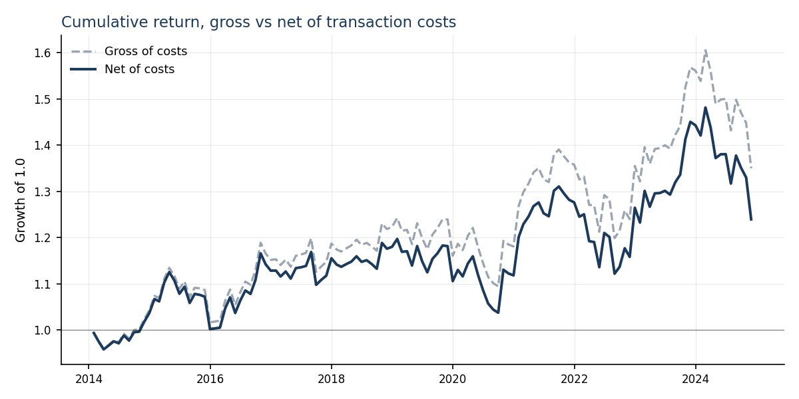
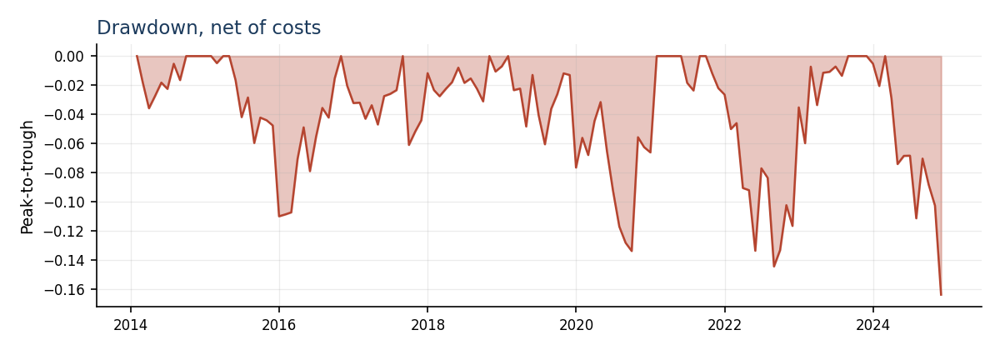
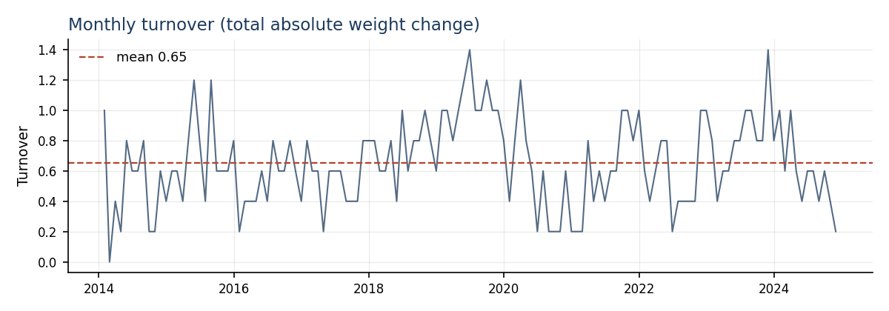

# Cross-Sectional Equity Signal: An Honest Backtest

[Portfolio case study](https://triasha72.github.io/Portfolio/case-backtest.html)


A monthly, dollar-neutral, cross-sectional equity strategy built to a strict
walk-forward protocol — and reported gross **and** net of transaction costs.

The point of this repository is not to present a profitable strategy. It is to
run a well-known effect through an evaluation protocol strict enough that the
result, whatever it turns out to be, can be believed.

---

## Hypothesis

Cross-sectional momentum (Jegadeesh & Titman, 1993) predicts the relative
ordering of next-month equity returns. Stated in the form actually tested:

> At the end of each month, a dollar-neutral portfolio long the top decile and
> short the bottom decile of predicted returns earns a positive average return
> over the following month, **net of transaction costs**.

The null is that any gross spread is consumed by turnover.

---

## Results

| Metric | Gross | Net |
| --- | --- | --- |
| Annualised Sharpe | 0.324 | **0.246** |
| Annualised return | — | 2.46% |
| Annualised volatility | — | 10.0% |
| t-statistic | — | 0.813 |
| Max drawdown | — | −16.4% |
| Hit rate | — | 52.7% |
| Avg monthly turnover | 0.652 | |
| Avg monthly cost | 6.5 bp | |
| Equal-weight universe Sharpe | 1.00 | |

Sample: 2014-01-31 to 2024-11-30, 131 months, 11,304 stock-months, 50 names
(`MMM` failed to download and is absent).







**Verdict: the signal does not survive transaction costs, and it was not
significant before them.** The baseline decile spread earns an annualised Sharpe
of 0.32 gross and 0.25 net of a 10bp charge on turnover, with a net t-statistic
of 0.81. Setting costs to zero raises the t-statistic only to 1.07 — the result
is indistinguishable from zero with or without trading frictions. Over the same
window, holding the 51-name universe equal-weighted returned a Sharpe of 1.00.
The strategy underperforms doing nothing.

This is the expected outcome rather than a surprising one. McLean & Pontiff
(2016) find published anomaly returns fall 58% post-publication, and large-cap
US equities are the most heavily arbitraged segment of the market. Read this as
a replication of that decay, not as a failed strategy.

### Every specification tested

| # | Specification | Sharpe gross | Sharpe net | t (net) |
| --- | --- | --- | --- | --- |
| 1, 6 | Baseline: 4 features, 10bp, decile spread | 0.324 | 0.246 | 0.813 |
| 2 | Momentum only (`--features mom_12_1`) | 0.238 | 0.154 | 0.510 |
| 3 | Cost sensitivity: 20bp | 0.324 | 0.168 | 0.554 |
| 4 | Zero-cost upper bound | 0.324 | 0.324 | 1.072 |
| 5 | Quintile spread instead of decile | 0.559 | 0.478 | 1.579 |

Runs 1 and 6 are the identical baseline; both are kept because both happened.
Run 6 is the one whose monthly returns produced the charts above.

Momentum alone is weaker than the full four-feature specification (0.238 gross
against 0.324), so reversal, volatility and liquidity do contribute something —
though not enough to matter, since no specification approaches significance.

**Significance.** Six runs across five distinct specifications were logged. The strongest was the quintile
spread at net Sharpe 0.478 and t = 1.58. Reported on its own that reads as a
near-miss. Read against six attempts it is noise, and it remains far below the
t = 3.0 hurdle adopted above — a hurdle stated before the result, not after.
Harvey, Liu & Zhu (2016) argue for exactly that threshold, precisely because the
literature has tested so many candidates.

The quintile improvement is also better explained by portfolio construction than
by signal. With 50 names a decile is five stocks per leg, which is far too
concentrated; widening to ten cuts annualised volatility from 10.0% to 7.3%
while annual return moves only from 3.24% to 3.47%. That is diversification,
not predictive power.

---

## Method

**Universe.** A fixed list of large-cap US equities (`data/universe.txt`),
monthly rebalancing.

**Features**, each computed at month *t* from information available at or before
the close of month *t*:

| Feature | Definition |
| --- | --- |
| `mom_12_1` | Cumulative return over months *t-11* … *t-1*, skipping the most recent month |
| `reversal` | Return during month *t* |
| `vol_12m` | Annualised std of daily returns, trailing 252 days |
| `liquidity` | Log mean daily dollar volume, trailing 63 days |

**Target.** Return over month *t+1*.

**Model.** Ridge regression on cross-sectionally standardised features. A linear
model is deliberate: with four features and a monthly panel, the binding
constraint is signal, not model capacity.

**Portfolio.** Rank predictions, long the top decile, short the bottom decile,
equal-weighted within each leg, dollar-neutral, gross exposure of 1.0.

**Costs.** 10 bps charged on every dollar traded, applied to realised turnover
computed month over month.

---

## What was controlled for

**Expanding-window walk-forward, not k-fold.** Observations in a financial panel
are not exchangeable across time — the ordering *is* the problem. At formation
month *t*, the training set contains only pairs whose labels had already been
realised by *t*. Nothing observed after *t* enters the fit. Shuffled k-fold on a
time series is the most common way a backtest fools its author, and it is not
used here.

**Cross-sectional standardisation, not pooled.** Features are standardised
within each date. Pooling would compare 2008 volatility against 2021 volatility
and let the level of the market leak into the ranks.

**No post-formation data as a feature.** Every input is causally prior to the
predicted return. This is a structural control rather than a procedural one: the
model cannot see downstream information because it is never given any.

**No retroactive shares outstanding.** True market capitalisation would need
historical share counts; applying today's share count to 2010 is lookahead. Log
dollar volume is used as a size/liquidity proxy instead, and the substitution is
stated rather than quietly made.

**A shuffled-target test.** `tests/test_pipeline.py` permutes the labels and
asserts the pipeline then earns nothing. If a leak existed, a shuffled target
would still score.

---

## Known limitations

**Survivorship bias — present and unfixed.** The universe file lists *currently
traded* tickers. Companies delisted, acquired, or bankrupted during the sample
are absent, so the sample conditions on survival and results are optimistic. A
clean run needs point-in-time constituents with delisting returns (CRSP via
WRDS). This is the largest single caveat on any number in this repository.

**The sample starts in 2014, not 2005.** Price history was pulled from 2005, but
the backtest requires all 50 names to have complete features in a month
(`min_names=50`), and at least one constituent listed late — ABBV was spun off
from Abbott in January 2013, so its first valid 12-month momentum falls in
January 2014. This excludes 2008–2013, and with it the 2009 momentum crash
(Daniel & Moskowitz, 2016) — the single most important stress period for this
signal. Relaxing `min_names` or dropping late-listing tickers would recover it,
and is the first thing to change in any follow-up.

**Costs are a flat assumption.** 10 bps per dollar traded is a reasonable
stand-in, not a market-impact model. Real costs vary with size, spread, and
capacity.

**No capacity analysis.** Equal-weighted decile portfolios over large caps say
nothing about how much capital the signal absorbs.

**Monthly frequency only.** Nothing here speaks to intraday or weekly horizons.

---

## Multiple testing

Every invocation of `run.py` appends a row to `results/variants_log.csv` with the
full configuration and the resulting statistics. That file is the denominator: a
t-statistic from the twentieth specification tried must be read against twenty
attempts. The log is committed deliberately, including the variants that failed.

---

## Running it

```bash
python -m venv .venv && source .venv/bin/activate
pip install -r requirements.txt

pytest tests/ -q                    # 7 tests, synthetic data, no network needed

python run.py --note "baseline: 4 features, 10bps, decile spread"
python make_plots.py

python run.py --features mom_12_1 --note "momentum alone"
python run.py --cost-bps 20 --note "cost sensitivity: 20bps"
python run.py --cost-bps 0  --note "zero-cost upper bound"
python run.py --decile 0.20 --note "quintile spread"
```

Outputs land in `results/`: per-month returns, a summary JSON, and the appended
variants log.

---

## References

Jegadeesh, N., & Titman, S. (1993). Returns to Buying Winners and Selling
Losers: Implications for Stock Market Efficiency. *The Journal of Finance*,
48(1), 65–91.

Daniel, K., & Moskowitz, T. J. (2016). Momentum crashes. *Journal of Financial
Economics*, 122(2), 221–247.

Harvey, C. R., Liu, Y., & Zhu, H. (2016). … and the Cross-Section of Expected
Returns. *The Review of Financial Studies*, 29(1), 5–68.
