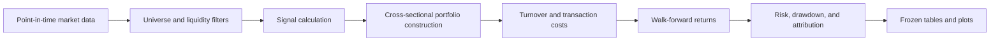

# System architecture

Every decision at date *t* uses information available by that date. Universe
membership, signal ranks, holdings, and costs are recorded separately so a good
return cannot hide survivorship bias or unrealistic trading assumptions.

This is a research backtest, not an execution or investment-advice system. A
production version would add a licensed corporate-actions feed, live order
state, broker reconciliation, monitoring, and explicit capital limits.
